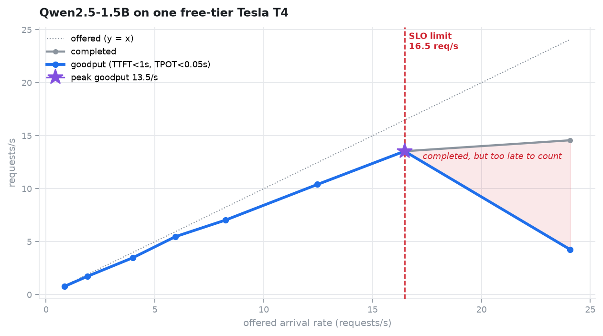
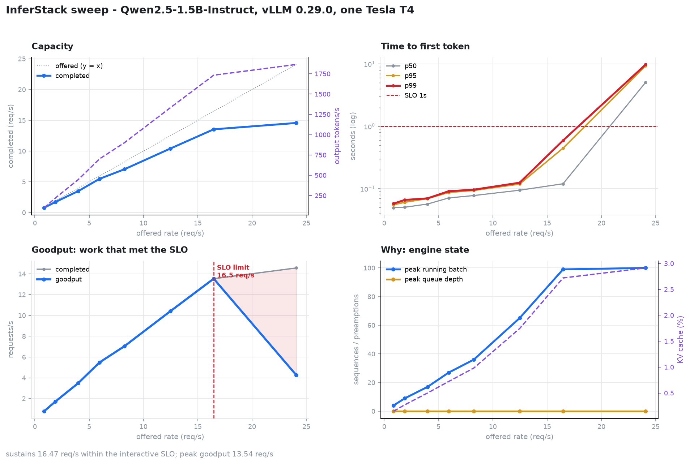

# InferStack

A self-hosted LLM inference stack, built to answer one question honestly: **how
much can this GPU actually serve, and how would you know?**

Serve an open model with continuous batching, put a real API in front of it,
instrument it, then load it until it breaks and write down where.

> You cannot optimize what you have never served.

---

## 16.5 requests per second — and the point where more load makes things worse



One **free-tier Tesla T4**. Qwen2.5-1.5B-Instruct, vLLM 0.29.0, 128-token
prompts, 128-token responses. Open-loop Poisson arrivals at eight rates.
[Every request that produced this is in the repo](artifacts/curated/phase04/records/).

| | Measured |
|---|---|
| **Sustained arrival rate** | **16.5 req/s** within TTFT < 1 s, TPOT < 50 ms |
| **Peak goodput** | **13.5 req/s** |
| Peak output throughput | 1,865 tok/s — *at a rate that misses the SLO* |
| TTFT p50 / p99 at the limit | 120 ms / 593 ms |

**Read the last two points on that chart together.** Pushing from 16.5 to
24 req/s made output throughput go **up** — 1,732 → 1,865 tok/s — while goodput
fell **69%**, from 13.5 to 4.3 req/s, and median time-to-first-token went from
120 ms to **5.1 seconds**.

A throughput-only benchmark reports 1,865 tok/s as this configuration's best
result. It is its worst. The GPU is busier than it has ever been and 82% of
arriving requests are already too late to be worth anything by the time they get
a first token. The shaded region is that work: completed, paid for in GPU time,
delivered after the deadline.

That gap is why this project reports **goodput** — throughput counting only
requests that met a stated service level — and why the service level is printed
next to every capacity number it produces.

### The finding that contradicted my own docs



Phase 3 of this project called `vllm:num_requests_waiting` *"the leading
indicator of latency pain"*. In this run it **never moved** — queue depth was
zero at every rate, including the one with five-second TTFT. KV-cache
utilisation peaked at **2.9%** of a cache the engine had sized for 322,944
tokens.

What moved was the running batch: **4 → 9 → 17 → 27 → 36 → 65 → 99 → 100**.

With `max_num_seqs=256` the scheduler admits almost everything straight into the
running batch instead of queueing it. Past ~65 concurrent sequences the T4
cannot drive the batch fast enough, so every request in it degrades together —
no queue, no cache pressure, no preemption. The binding constraint is **compute**,
and the "78.84× concurrency headroom" this project measured in Phase 1 is real
arithmetic about memory that is unreachable in practice at this shape. Sizing a
deployment from it would over-provision by roughly fourfold.

→ [The full result, with what it does not show](artifacts/curated/phase04/sweep.md)

## Why you can believe the number

Three things separate this from a load test that agrees with whatever you hoped.

**The load does not adapt to the server.** Arrival times are drawn from a
Poisson process and fixed *before the run starts*. Almost every naive benchmark
is closed-loop — N workers each waiting for a response before sending again — so
when the server slows down the generator quietly sends less, and the measurement
hides the problem it was built to find.

**Latency is measured from when a request was *due*, not when it was sent.** A
generator that is itself saturated ships a request late, and the user waited
that time whether or not anything recorded it. Every record carries both clocks
and the gap is reported per step; if it ever exceeds 250 ms the whole sweep is
marked **invalid** and the CLI exits non-zero. That is not decoration —
[here is the run where it fired](artifacts/curated/phase04/generator-ceiling.md),
and the manufactured "saturation knee" it prevented from being published.

**The workload is pinned, and one that was not is kept as evidence.** The first
sweep on real hardware passed every validity check the harness has and was
worthless: the prompt asked the model to summarise in one word, it obliged with
three tokens per response, decode never ran, and the curve came out perfectly
flat. [It is still in the repo](artifacts/curated/phase04/the-first-sweep-measured-nothing.md),
because the lesson is that the checks guard the *measurement* and nothing guards
the *workload*.

## Before the curve: continuous batching, proven

The capacity number above only means something if the engine batches at all.
Measured on the same T4 — [artifacts](artifacts/curated/phase01/):

```
 1 request  alone         ████████████████████                     0.95 s
 8 requests if serial     ████████████████████████████████████…    7.58 s  (projected)
 8 requests measured      ██████████████████████                   1.04 s  ←

                                              7.3× faster than serial
                                              91% of the theoretical 8× ceiling
```

| | Measured |
|---|---|
| Time to first token | **26 ms** |
| Time per output token | **14.6 ms** |
| Output throughput | 493 tok/s |
| Engine cold start to healthy | 137.5 s |

> The KV cache arithmetic was predicted before the run:
> `2 × 28 layers × 2 KV heads × 128 head_dim × 2 bytes` = **28,672 bytes/token**.
> The engine measured **28,687**. Theory and hardware agree to 0.05%.

And the gateway in front of it costs **7 ms** of TTFT — 33 ms through it against
26 ms direct, with the 7.3× batching speedup intact at 7.38×
([Phase 3](artifacts/curated/phase03/gateway-in-front-of-vllm.md)).

## Use it on an endpoint you already have

**No GPU needed.** The smoke harness speaks plain OpenAI-compatible HTTP, so it
measures anything that does — vLLM, SGLang, TGI, llama.cpp, LM Studio, Ollama,
or a hosted API:

```bash
pip install git+https://github.com/thealonemusk/InferStack@phase-04-bench

inferstack smoke --base-url http://your-host:8000/v1 --model your-model -c 8
```

A serialised server and a batching one look **identical** from a single request.
They diverge completely under concurrency, and you cannot see it without
looking. If the speedup comes back near **1.0×**, your requests are queueing —
batching is off, `max_num_seqs` is 1, or something in front is serialising them.

It exits non-zero when the server is unreachable, when a request fails, **or
when requests were served serially instead of batched** — so it works as a CI
gate that catches config regressions a health check never would:

```yaml
- run: inferstack smoke --base-url ${{ vars.INFERENCE_URL }} --model ${{ vars.MODEL_ID }} -c 16
```

And if the thing you already run is a vLLM, you can read its own signals the
same way — no Prometheus, no Grafana, no agent:

```bash
inferstack metrics --url http://your-host:8000
```

```
+- Load ----------------------------------------------------------+
| Signal         Value  Reads as                                  |
| Running batch      8  sequences decoding now                    |
| Queue depth        0  requests queued ahead of the batch        |
| KV cache        1.3%  headroom for more concurrency             |
| Preemptions        0  recompute on eviction; p99 spikes live here|
+-----------------------------------------------------------------+
+- Latency -------------------------------------------------------+
| Histogram    count       p50      p90      p99     mean         |
| ttft             9   57.5 ms  75.5 ms  79.6 ms  54.4 ms         |
| tpot             9   17.5 ms  23.5 ms  24.9 ms  14.6 ms         |
+-----------------------------------------------------------------+
```

*Output rendered from the synthetic fixture in `tests/fixtures/`, so the
numbers above are made up. The metric names and labels are not: they come from
[a capture taken off a real vLLM 0.29.0](tests/fixtures/vllm_metrics_real.txt),
and a test asserts every signal this command looks for exists in it.*

Load is printed above latency deliberately: a p99 of 4 s means one thing at
queue depth 60 and something entirely different at queue depth 0. Percentiles
come from bucket counts using the same interpolation as Prometheus'
`histogram_quantile`, so these numbers and a Grafana panel agree — and the
output says out loud that they are no finer than the engine's bucket
boundaries.

`--duration 60 --interval 0.2 --out run.jsonl` samples instead of reading once,
which is how a run's signals survive a GPU session nothing can scrape into.

### Get your own capacity number

The same sweep that produced the chart at the top runs against any
OpenAI-compatible server:

```bash
inferstack bench --base-url http://your-host:8000/v1 --model your-model   --rates 2,4,8,12,16,24 --duration 30   --ttft-slo 1.0 --tpot-slo 0.05 --plot
```

You get the curve, the arrival rate your SLO actually survives, and a per-request
JSONL of everything it measured. If the load generator cannot keep up it says so
and exits non-zero rather than handing you its own limits dressed as yours.

Your SLO is not mine, and the capacity number moves when it changes — so re-judge
a finished run without touching the GPU again:

```bash
inferstack analyse <records-dir> --ttft-slo 5 --tpot-slo 0.2 --name batch
```

Same measurement, different service level, different and equally correct answer.
That is the whole reason the per-request records are written down.

Already serving your own model? Swapping a hosted API for this one is a one-line
change, because the endpoint is OpenAI-compatible:

```python
client = OpenAI(base_url="http://localhost:8000/v1", api_key="not-used-yet")
```

→ **[docs/INTEGRATION.md](docs/INTEGRATION.md)** for all four integration paths,
workload-specific tuning, and a blunt list of what isn't built yet.

## What this is

Most "LLM serving" tutorials stop at a working endpoint. The interesting part
starts afterwards: what happens to p99 when the arrival rate doubles, what
`max_num_seqs` actually trades away, and why a throughput number with no service
level beside it is a measure of how busy a GPU was rather than of how much it
accomplished.

InferStack is built phase by phase, each leaving behind a decision record and a
reproducible measurement.

**New here?** Read **[docs/PROJECT-GUIDE.md](docs/PROJECT-GUIDE.md)** — the
theory (prefill vs decode, KV cache sizing, PagedAttention, continuous batching,
goodput), the architecture, and every decision with its reasoning.

## Roadmap

| Phase | Deliverable | Status |
|---|---|---|
| 0 | Foundations: execution profiles, hardware probe, config, ADRs | ✅ done |
| 1 | vLLM serving + continuous batching proven on real hardware | ✅ **done** |
| 2 | FastAPI gateway: auth, SSE streaming, timeouts, backpressure | ✅ **done** |
| 3 | Prometheus + Grafana: TTFT, TPOT, queue depth, KV-cache utilisation | ✅ **done**, verified against a real vLLM |
| 4 | Benchmark harness: Poisson arrivals, open-loop sweeps, goodput | ✅ **done**, on a T4 |
| 5 | Continuous batching tuning, latency/throughput Pareto curves | next — and [the curve says where to start](artifacts/curated/phase04/sweep.md) |
| 6 | AWQ/GPTQ int4, prefix caching, speculative decoding, tensor parallelism | |
| 7 | Rate limiting, admission control, graceful drain, multi-replica routing | |
| 8 | SGLang on the identical harness, head to head | |
| 9 | Written benchmark report | |

## Engineering notes worth stealing

Things this project does that most don't:

**It publishes the run that measured nothing.** The first sweep on real hardware
passed every check the harness has — Poisson arrivals, a generator late by
16 ms, honest percentiles, the engine drained between steps — and produced a
flat line, because the prompt asked the model for a one-word summary and got
one. Three tokens per response. The tell was 96 output tokens/s at 32 req/s, and
it took dividing one column by another to see it.
[It is still in the repo.](artifacts/curated/phase04/the-first-sweep-measured-nothing.md)
Validity checks guard the measurement; nothing guards the workload.

**Its benchmark knows its own ceiling.** A load generator has a capacity too,
and one that does not measure it reports it as the server's. This one is late by
tens of milliseconds up to ~40 req/s and by more than a second past it — and at
that point it refuses to publish, prints why, and exits non-zero.
[Measured, with the fake knee it prevented.](artifacts/curated/phase04/generator-ceiling.md)

**It contradicts its own documentation when the data says to.** Phase 3 called
queue depth "the leading indicator of latency pain". Phase 4 measured it at zero
through a collapse from 13.5 to 4.3 req/s of goodput, and the docs now say so
and explain why.

**It refuses to run configurations that cannot work.** `inferstack doctor`
probes the machine, derives capabilities from CUDA compute capability, and exits
non-zero before anything expensive happens. On a metered free-tier GPU,
discovering a dtype mismatch *after* a 3 GB download is a real cost.

```
$ inferstack doctor --profile colab-t4
FAIL  engine.device
      Profile requests CUDA but no NVIDIA GPU is visible.
      -> Switch to the local-cpu profile, or run this on Colab/Kaggle.
```

**It measures TTFT correctly.** OpenAI-compatible streams open with a role-only
delta carrying no content. Counting it as the first token understates TTFT by a
full inter-token gap. There is a regression test named for it.

**It asks the engine what it accepts.** vLLM removed `--swap-space` and
`--device` when the V1 engine made preemption recompute-only. Rather than pin a
version table that drifts, the launcher reads the installed binary's own
`--help` — and *fails safe*, stripping nothing when it cannot get a plausible
answer.

**It never reports a number it cannot attribute.** Every run records the exact
argv, the vLLM version, and the active attention backend, because results are
not comparable across backends.

**Its gateway adds no buffering — and that is measured, not asserted.** Against
an upstream emitting SSE chunks 200 ms apart, time-to-first-byte through the
gateway is 218 ms versus 229 ms direct. A buffering proxy would have shown
~1000 ms and silently destroyed the 26 ms TTFT above.

**It knows what its own edge costs.** Phase 1's batching proof, re-run *through*
the gateway against the same T4: **7.38× speedup versus 7.3× direct, 479 tok/s
versus 493, TTFT 33 ms versus 26 ms.** So the gateway costs about 7 ms — and
that figure is corroborated by an independent measurement on a different machine
against a fake upstream, which put it at 7.5 ms. An HTTP hop costs what an HTTP
hop costs; the instrumentation is not resolvable underneath it.

**It reports latency as a distribution, and admits what that costs.** Percentiles
come from Prometheus bucket counts, because a mean TTFT of 200 ms is compatible
with a p99 of 8 s and percentiles cannot be recovered by averaging percentiles.
Interpolating inside a bucket has a price, and it is asserted in a test rather
than glossed: a distribution whose exact median is 55 ms reads back as 57.5 ms
through vLLM's default TTFT buckets, and an exact p99 of 61 ms reads back as
79.6 ms.

**Its metrics cannot disagree with the thing they describe.** In-flight and
queued request counts are *collected from* the admission controller when
Prometheus scrapes, not mirrored into gauges that the request path increments. A
second copy is how Phase 2's slot leak would have reported itself as healthy.

**And when a measurement comes out impossible, it says so.** Instrumentation
cannot make a server faster, yet metrics-on measured 1.0 ms faster than
metrics-off over 300 requests. That is the resolution of the method, not a
finding, and [the artifact says exactly
that](artifacts/curated/phase03/gateway-metrics.md) instead of rounding it to
"free".

**It tests against a capture, not against its own assumptions.** Phase 3 shipped
declaring vLLM's TPOT metric as `vllm:time_per_output_token_seconds`. The real
engine emits `vllm:request_time_per_output_token_seconds` — and *nothing
failed*: the signal read as missing, the Grafana panel read "No data", the alert
stayed silent. Three symptoms indistinguishable from a healthy idle system, and
all three survived because the fixture and the code were written from the same
guess. There is now [a capture from a real
engine](tests/fixtures/vllm_metrics_real.txt) and a test that every declared
signal exists in it.

**Its dashboard has actually been rendered.** Prometheus and Grafana are started
against the committed configuration, every panel query is executed, and every
rule is loaded — 11/11 panels returning data, 13 rules, zero errors. A panel
whose PromQL is well-formed and returns nothing looks exactly like an idle
system, so "the queries name real metrics" was never enough.

## Target hardware

Three deliberately different machines, each described by a profile in
`configs/profiles/`:

| Profile | Machine | Role |
|---|---|---|
| `local-cpu` | CPU-only laptop, no NVIDIA GPU | Development, tests, API correctness |
| `colab-t4` | 1× Tesla T4 (SM 7.5, 16 GB) | Single-GPU benchmarks |
| `kaggle-2xt4` | 2× Tesla T4 (SM 7.5, PCIe) | Tensor parallelism, longer sweeps |

Turing has no bfloat16, no FP8, and sits below vLLM's FlashAttention-2
requirement. Those constraints are encoded in code, not in someone's memory —
see [ADR-0002](docs/adr/0002-hardware-execution-profiles.md).

`local-cpu` is a development target only. No performance number from it is ever
reported as a result.

## Quickstart

Requires Python 3.11 or 3.12 and [uv](https://docs.astral.sh/uv/).

```bash
uv venv
uv pip install -e ".[dev]"

inferstack doctor                    # what is this machine, can the profile run here?
inferstack profiles                  # available execution profiles
inferstack serve --dry-run           # print the exact vLLM command, launch nothing
inferstack smoke -c 8                # prove the server batches (exits 1 if it doesn't)
inferstack gateway                   # OpenAI-compatible edge: auth, streaming, backpressure
inferstack metrics                   # queue depth, KV cache, TTFT/TPOT percentiles

# ...or measure something you already run, no GPU required:
inferstack smoke --base-url http://your-host:8000/v1 --model your-model
inferstack metrics --url http://your-host:8000
```

On a GPU session the whole Phase 1 run happens unattended — install, serve,
measure, export — via `src/inferstack/remote/kernels/serve_smoke.py`.

## Configuration

Settings resolve highest-priority first:

1. Environment variables — `INFERSTACK_ENGINE__MAX_NUM_SEQS=64`
2. `.env` (copy from `.env.example`)
3. The active profile YAML
4. Field defaults in `src/inferstack/config.py`

## Layout

```
configs/profiles/     one YAML per target machine
src/inferstack/
  config.py           typed settings and profile loading
  probe.py            hardware detection -> named capabilities
  compat.py           profile vs. hardware validation
  cli.py              the inferstack command
  engine/             launcher, measuring client, batching smoke check
  remote/             drive Kaggle GPU sessions from code
  gateway/            HTTP API in front         (Phase 2)
  observability/      metrics: read, summarise, expose (Phase 3)
  bench/              open-loop load, goodput, charts  (Phase 4)
deploy/compose/       Prometheus + Grafana, dashboard included
scripts/              one-off measurement scripts behind the artifacts
artifacts/curated/    measured results, committed
.github/workflows/    CI: lint, types, tests, the measurement, promtool
docs/PROJECT-GUIDE.md theory, architecture, decisions
docs/adr/             architecture decision records
docs/phases/          what each phase built and how to verify it
```

## Development

```bash
pytest              # 364 tests
ruff check .        # lint, including bandit security rules
pre-commit install  # run both on every commit
```

## Documentation

- **[Project guide](docs/PROJECT-GUIDE.md)** — theory, architecture, and how to defend every decision
- **[Integration guide](docs/INTEGRATION.md)** — plugging this into an existing workflow
- **[CONTEXT.md](CONTEXT.md)** — full state snapshot: decisions, measured results, gotchas, next steps
- [Phase 0 — Foundations](docs/phases/phase-00-foundations.md)
- [Phase 1 — Baseline serving](docs/phases/phase-01-baseline-serving.md) — including the three runs it took, and why each failure was real
- [Phase 2 — The gateway](docs/phases/phase-02-gateway.md) — auth, streaming pass-through, admission control
- [Phase 3 — Observability](docs/phases/phase-03-observability.md) — the four signals, histograms not averages, and what the instrumentation costs
- [Phase 4 — The benchmark harness](docs/phases/phase-04-bench.md) — open-loop load, goodput, and the curve
- **[docs/REVIEW.md](docs/REVIEW.md)** — reading order for the stacked branches, if you are reviewing this
- [Architecture decision records](docs/adr/)

## Licence

MIT
