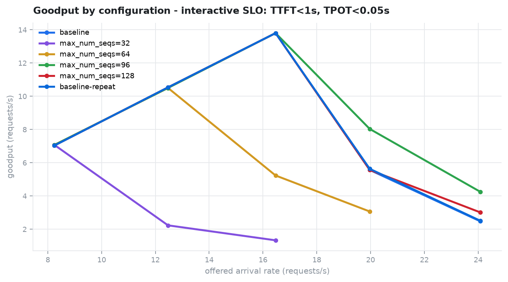

# Does lowering `max_num_seqs` buy capacity on a T4?

Date: 25 Sep 2026. Kaggle, **2× Tesla T4** attached (SM 7.5; `colab-t4` uses one),
vLLM **0.29.0**, TRITON_ATTN for every configuration, Qwen2.5-1.5B-Instruct in
float16. Kernel `inferstack-phase05-tune`, one session of 2,614 s.

Six engine configurations, run back to back in one session with a restart
between each: `baseline` (`max_num_seqs=256`), then 32, 64, 96 and 128, then
`baseline-repeat` (256 again). Each got the same open-loop Poisson ladder:
8, 12, 16, 20, 24, 28 and 32 req/s, 30 s per rate, 128 prompt tokens and exactly
128 output tokens. A ladder stopped after two consecutive steps missed the
interactive SLO.

This is the first sweep in the project run with the **uncapped** load
generator (ADR-0009). Every per-request record is in `variants/*/records/`.
Recompute any of this with:

```bash
inferstack tune-report artifacts/curated/phase05/variants --plot
```



## The answer: no

| `max_num_seqs` | sustainable, interactive | peak goodput | peak tok/s | TTFT p99 at the limit |
|---|---|---|---|---|
| 32 | 8.25 req/s | 7.07 | 1,071 | 328 ms |
| 64 | 12.47 req/s | 10.50 | 1,592 | 126 ms |
| 96 | **16.47 req/s** | **13.80** | 1,933 | 417 ms |
| 128 | **16.47 req/s** | **13.80** | 1,959 | 159 ms |
| 256 (baseline) | **16.47 req/s** | **13.80** | 1,976 | 153 ms |
| 256 (repeat) | **16.47 req/s** | **13.80** | 1,980 | 163 ms |

Interactive SLO: TTFT < 1 s and TPOT < 50 ms. 32 and 64 are strictly worse. 96,
128 and 256 tie, and the ladder's 4 req/s spacing cannot separate them: all
three pass at 16.47 req/s and all three fail at 19.97 req/s. **The default
stays at 256.**

## Why the hypothesis was wrong, even though its mechanism was right

The prediction was that a smaller cap would make the engine **queue** excess
requests instead of slowing every request in the batch. That is exactly what
happened:

| at 19.97 req/s | batch | queue | TTFT p50 | TPOT p99 | engine queue time, mean | goodput |
|---|---|---|---|---|---|---|
| `max_num_seqs=256` | 181 | 0 | 172 ms | **65 ms** | 0 ms | 5.57 |
| `max_num_seqs=128` | 128 | 37 | 536 ms | 54 ms | 540 ms | 5.57 |
| `max_num_seqs=96` | 96 | 62 | **1.72 s** | **43 ms** | 1,579 ms | 8.03 |

With 256 the batch absorbs everything, so TPOT breaks the SLO while TTFT is
still fine. With 96, TPOT holds at 43 ms and the extra requests wait instead.
The engine's own histograms put that wait in the scheduler queue (mean 1.58 s),
not in prefill (80 ms).

What the hypothesis missed is that 20 req/s is **above capacity**. It asks for
2,560 output tokens per second, and no configuration here ever produced more
than 1,980. Scheduling decides *which* requests pay for an overload. It cannot
remove the overload, so the sustainable rate is set by the GPU's throughput,
between 16.5 and 20 req/s, whatever the cap.

A smaller cap does change the **overload** behaviour: `max_num_seqs=96` kept
8.03 req/s of goodput at 20 req/s and 4.25 at 24, against 5.57 and 2.48 for
the baseline. That is graceful degradation, not capacity. The frontier's two
axes, sustainable rate and peak goodput, do not capture it, so it is stated
here instead.

## The corrected baseline, beside Phase 4

Same profile, same workload and same seed. The only difference is the
connection cap.

| offered | Phase 4 (capped at 100) TTFT p50 / p99 | Phase 5 baseline TTFT p50 / p99 | Phase 5 TPOT p99 | client in flight / engine batch |
|---|---|---|---|---|
| 12.47/s | 95 / 125 ms | 96 / 120 ms | 35 ms | 64 / 61 |
| 16.47/s | 120 / 593 ms | 118 / **153 ms** | 42 ms | 105 / 102 |
| 24.08/s | **5.08 s / 9.80 s** | **234 / 826 ms** | 93 ms | 273 / 255 + 12 queued |

- **At 12.5 req/s** the two runs agree, as they should: the cap never bound there.
- **At 16.5 req/s** the p99 was the cap. 593 ms falls to 153 ms.
- **At 24 req/s**, all but about 0.23 s of Phase 4's 5.08 s median TTFT was spent in our own connection pool.

The sustainable rate is the same **16.47 req/s**. The reason it stops there is
different: TPOT fails first, not TTFT.

## What the engine was doing

- **KV cache is not the limit.** Its peak was 6.6% of the cache, at 24 req/s, in the baseline.
- **Compute is the limit.** As the batch grows from 34 to 255 sequences, TPOT p99 rises from 28 to 93 ms.
- **Queue depth leads when the cap binds.** With `max_num_seqs` below the batch the load demands (96 and 128 here), queue depth and TTFT are the first signals to move. With 256 on this GPU the queue stays at zero until about 24 req/s, and TPOT is the signal to watch.
- **Engine and client agree.** At every healthy step the engine's own mean TTFT is 9–22 ms below the client's median, which is roughly the HTTP and streaming hop. (A mean against a median, so this shows direction and size, not a precise hop cost.) Where requests queue, engine queue time accounts for almost all of the client's TTFT.

## Batch SLO, re-judged from the same records

Batch SLO: TTFT < 5 s, TPOT < 200 ms. No GPU time was used.

| `max_num_seqs` | sustainable | peak goodput |
|---|---|---|
| 32 | 8.25 | 7.07 |
| 64 | 16.47 | 12.28 |
| 96 | 19.97 | 14.90 |
| 128 | 19.97 | 15.21 |
| 256 | **≥ 24.08** | 15.44 |
| 256 repeat | **≥ 24.08** | 15.47 |

Two caveats come with this table:

- **The baseline's 24.08 is a floor, not a measurement.** The early stop was judged on the *interactive* SLO, so every ladder ended at 24 req/s, and the batch capacity above that was never offered.
- **The tool's "frontier" picks `baseline-repeat` alone.** It wins by 0.03 req/s of peak goodput. That is smaller than the difference between two runs of the identical configuration, so it is noise, not a result.

## How far to trust it

- **Noise.** The baseline and its repeat, first and last in the session, agree within 1–7% on every figure at every rate (goodput 5.57 vs 5.63 at 20 req/s). That is the only noise estimate the session has, from one pair.
- **Generator.** It kept up everywhere; the worst lag was 111 ms against a 250 ms threshold.
- **Held requests.** No step was flagged: client in flight matched engine running plus waiting at every rate.
- **Ladder resolution.** The knee lies between 16.47 and 19.97 req/s. Rates of 17, 18 and 19 would locate it, and would be the first place 96, 128 and 256 could differ.
- **KV cache size varied between starts.** It was 322,944 tokens for the first baseline and 338,512 for the repeat, a 4.8% difference; smaller caps got more (352,992 at 32). The cause is not established. It does not affect these results, because the cache never passed 6.6%.
- **The GPU-release check passed, but proved less than it appears.** `nvidia-smi` read 0 MiB before every start and after every stop. No reading was ever taken while an engine was up, so the check has not yet been seen to *catch* a held GPU. The KV sizes above, all at or above the first run's, are the independent evidence that no configuration started on a GPU still holding its predecessor.
- **Startup.** The first start took 721 s, a cold `torch.compile` cache. Later starts took 87–103 s.
